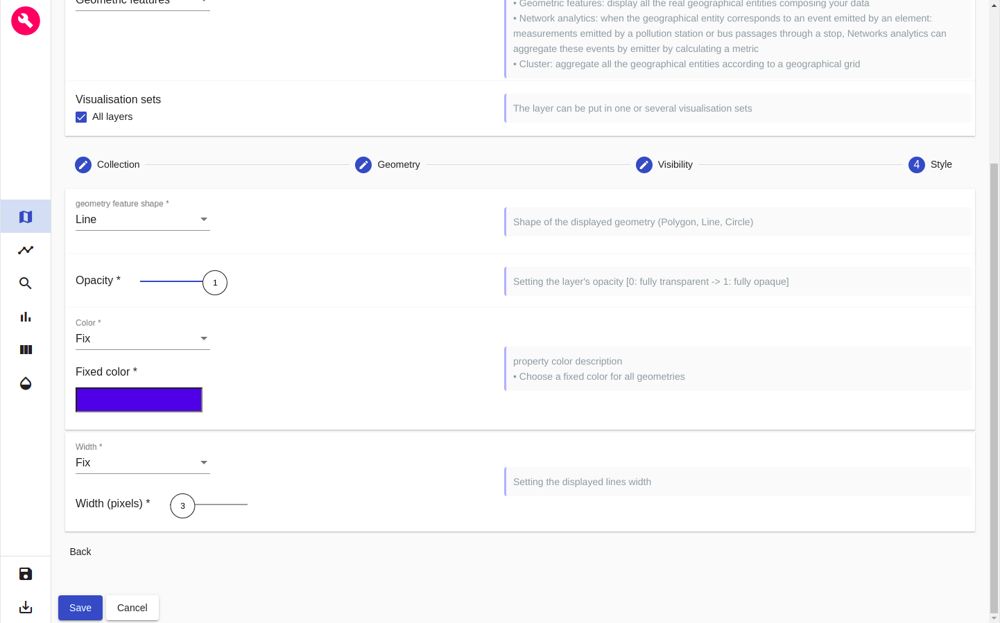
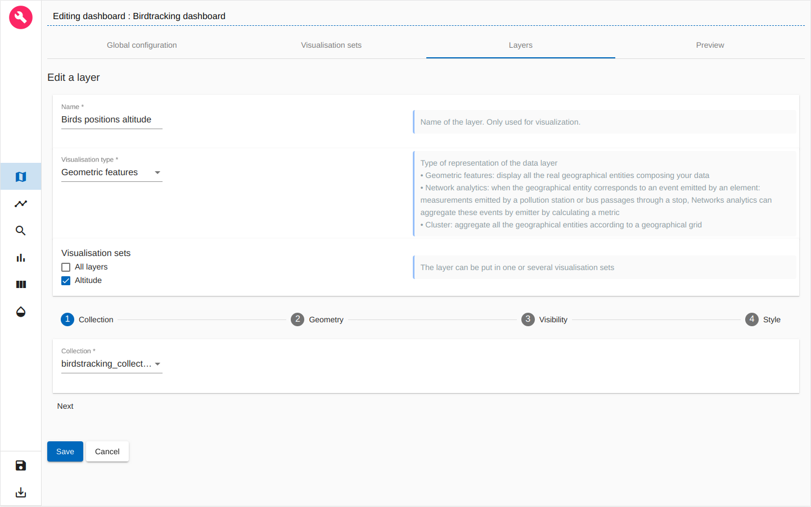
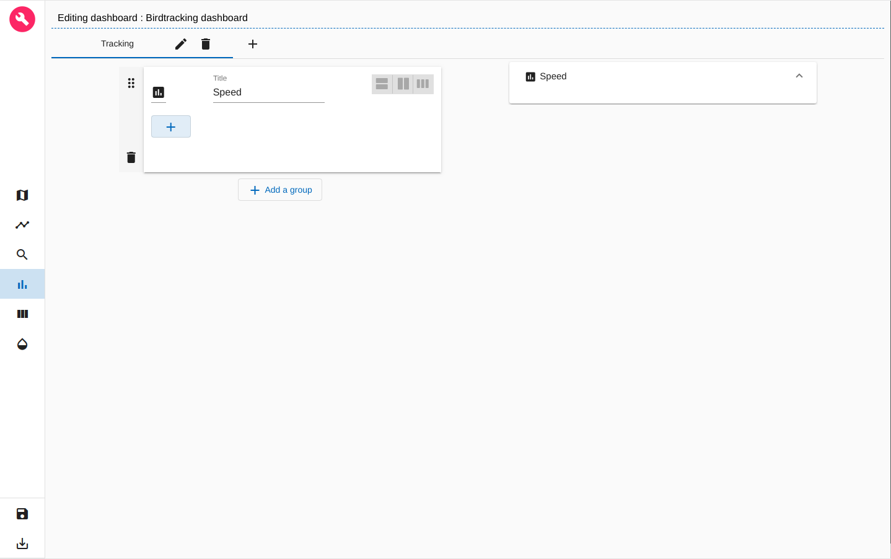
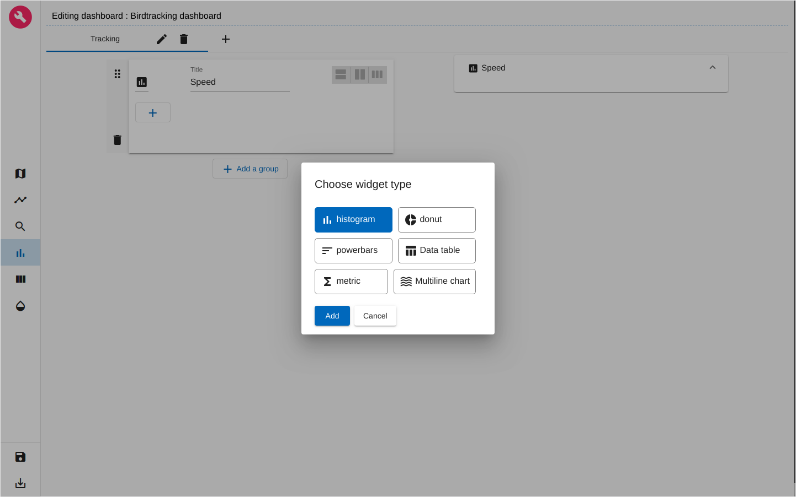

# ARLAS-stack-birdstracking-tutorial

## About this tutorial
### What will you learn ?
With this tutorial, you'll be able to:
- start an ARLAS-Exploration stack
- Index some birdtracking data in Elasticsearch
- Reference the indexed birdtracking data in ARLAS
- Create a view of ARLAS-wui (a dashboard) to explore the birdtracking data using ARLAS-wui-hub and ARLAS-wui-builder

### What will you need ?

You will need :
- docker & docker-compose
- curl

### What will you get ?


## Birdstracking data

Let's explore some white storks migration data, provided by __the Movebank Data Repository__. 

We built a subset of the dataset provided in [this package](doi:10.5441/001/1.ck04mn78) by Movebank.

The subset is `birdstracking_data.csv`. It contains around 77 000 birds GPS positions described with 7 columns:

- identifier: An identifier of the emitted position
- name: Name of the moving bird
- location: Coordinates of the emitted position as longitudes/latitudes
- timestamp: Moment when the position is emitted
- speed_ms: Speed of the bird at this postion (m/s)
- height_m: Altitude of the birds at this position (m)
- trail: Linestring between the current position of the bird and the next one

A line of the csv file looks like:

|identifier|name|location|timestamp|speed_ms|height_m|trail|
|---|---|---|---|---|---|---|
|009829e...|Redrunner + / DER AU057 (eobs 3339)|'{"lon":8.7,"lat":50.4}'|1491922507|190.65|0.15|'{"coordinates":[[8.7,50.4],[8.72,50.41]],"type":"LineString"}'|
## Exploring Birdstracking data

We will explore this data using ARLAS.

__0. Download this tutorial__

```shell
git clone https://github.com/gisaia/ARLAS-stack-birdstracking-tutorial.git
```

__1. Starting ARLAS Exploration Stack__

- Get the docker-compose file from [ARLAS-Exploration-stack](https://github.com/gisaia/ARLAS-Exploration-stack.git) that will allow us to start the ARLAS stack

    ```shell
    curl -XGET \
        "https://raw.githubusercontent.com/gisaia/ARLAS-Exploration-stack/blob/develop/docker-compose.yaml" \
        -o docker-compose.yaml
    ```
- Start the ARLAS stack 
    ```shell
    docker-compose up -d \
        arlas-wui \
        arlas-hub \
        arlas-builder \
        arlas-server \
        arlas-persistence-server \
        elasticsearch
    ```
    6 services are started:
    - ARLAS-wui at http://localhost:8096
    - ARLAS-wui-builder at http://localhost:8095
    - ARLAS-wui-hub at http://localhost:8094
    - ARLAS-server at http://localhost:19999/arlas/swagger
    - ARLAS-persistence at http://localhost:19997/arlas-persistence-server/swagger
    - Elasticsearch at http://localhost:9200

    Check that the 6 are up and running using the following command: 

    ```shell
    docker ps
    ```

__2. Indexing birdtracking data in Elasticsearch__

- Create `birdstracking_index` index in Elasticsearch with `configs/birdtracking.es_mapping.json` mapping file

    ```shell
    curl -XPUT http://localhost:9200/birdstracking_index/?pretty \
    -d @configs/birdtracking.es_mapping.json \
    -H 'Content-Type: application/json'

    ```

    You can check that the index is successfuly created by running the following command

    ```shell
    curl -XGET http://localhost:9200/birdstracking_index/_mapping?pretty
    ```

- Index data in `birdstracking_data.csv` in Elasticsearch
    - We need Logstash as a data processing pipeline that ingests data in Elasticsearch. So we will download it and untar it:

        ```shell
        ( wget https://artifacts.elastic.co/downloads/logstash/logstash-7.4.2.tar.gz ; tar -xzf logstash-7.4.2.tar.gz )
        ```
    - Now we can index the data:

        ```shell
        cat birdstracking_data.csv \
        | ./logstash-7.4.2/bin/logstash \
        -f configs/birdtracking2es.logstash.conf
        ```
    - Check if __77 384__ birds positions are indexed:

        ```shell
        curl -XGET http://localhost:9200/birdstracking_index/_count?pretty
        ```
__3. Declaring `birdstracking_index` in ARLAS__

ARLAS-server interfaces with data indexed in Elasticsearch via a collection reference.

The collection references an identifier, a timestamp, and geographical fields which allows ARLAS-server to perform a spatial-temporal data analysis


- Create a Birdstracking collection in ARL  AS

    ```shell
    curl -X PUT \
    --header 'Content-Type: application/json;charset=utf-8' \
    --header 'Accept: application/json' \
    "http://localhost:19999/arlas/collections/birdstracking_collection?pretty=true" \
    --data @birdstracking_collection.json
    ```

    Check that the collection is created using the ARLAS-server `collections/{collection}`

    ```
    curl -X GET "http://localhost:19999/arlas/collections/birdstracking_collection?pretty=true"
    ```
__4. Create a dashbord to explore `birdstracking data` with ARLAS__

ARLAS stack is up and running and we have birdstracking data available for exploration. We can now create our first dashboard composed of 
- a map to observe the birds trails, the positions' geographical distribution
- a timeline presenting the number of birds positions over time
- a search bar to look for birds by their names for instance
- some widgets to analyse the data from another axis such as the speed distribution.

To do so, let's go to ARLAS-wui-hub at http://localhost:8094 and create a new dashboard named `Birdstracking dashboard`

<p align="center">
    
</p>
<p align="center" style="font-style: italic;">
figure 0: Creation of a dashboard in ARLAS-wui-hub
</p>

After clicking on __Create__, you are automatically redirected to ARLAS-wui-builder to start configuring your dashboard.

### Choosing the collection

The first thing we need to do is to tell ARLAS which collection of data we want to use to create our dashboard

<p align="center">
    
</p>
<p align="center" style="font-style: italic;">
figure 1: Choose collection
</p>

in our case we choose the `birdtracking_collection`

### Map configuration

As a first step, I'll set the map at zoom level 7 and the map's center coordinates at Latitude=44° and Longitude=4°. This way, when loading my dashboard in ARLAS-wui, the map will be positionned over France.

<p align="center">
    
</p>
<p align="center" style="font-style: italic;">
figure 2: Map initialisation
</p>

For now, the map is empty. __The first thing we want to find out is where the birds are passing by?__

<p align="center">
    
</p>
<p align="center" style="font-style: italic;">
figure 3: Layers view
</p>

To do so, let's add a layer named `Birds trails` to visualise the birds paths.

<p align="center">
    
</p>
<p align="center" style="font-style: italic;">
figure 4: Adding a <b>Gemetric features</b> layer named 'Birds trails'
</p>

In the `Geometry` section (2nd section), choose the _trail_ features geo-field

<p align="center">
    
</p>
<p align="center" style="font-style: italic;">
figure 5: Choosing the geometry field to display on the map
</p>

Now, let's define the layer's style. As a starter, we choose the best representation of our geometries: Birds trails are lines. We also choose a fixed color (blue for instance) and a fixed width of 3 pixels

<p align="center">
    
</p>
<p align="center" style="font-style: italic;">
figure 6: Customising 'Birds trails' style
</p>

After clicking on __Save__, our first layer is created

<p align="center">
    
</p>
<p align="center" style="font-style: italic;">
figure 7: New layer 'Birds trail' is created
</p>

We can go and preview the layer in `Preview` tab

<p align="center">
    
</p>
<p align="center" style="font-style: italic;">
figure 8: Preview of 'Birds trail' layer
</p>

We see now where the birds are passing by thanks to this layer


### Timeline configuration

Let's find out the time period when these positions were emitted.

For that, let's define a timeline: a histogram that will represent the number of birds positions over time.

For the x-Axis we choose the `timestamp` field and for the y-Axis we choose `Hits count`: the number of positions in each bucket. We set 50 buckets in this example 

<p align="center">
    
</p>
<p align="center" style="font-style: italic;">
figure 9: Defining a timeline
</p>

In the _Render_ tab we can set a title for the timeline, date format and the histogram type. Let's choose bars histogram

<p align="center">
    
</p>
<p align="center" style="font-style: italic;">
figure 10: Timeline render
</p>

### Search bar configuration

To define the search bar we can set 
- the placeholder string;
- the field used to seach keywords
- the field used to autocomplete the searched words

<p align="center">
    
</p>
<p align="center" style="font-style: italic;">
figure 11: Defining the search bar
</p>

### Save the dashbord and start exploring in ARLAS-wui

Now we defined
- 'Birds trails' layer in the map
- the timeline
- the search bar

Let's save this dashboard by clicking on the 'Disk' icon at the left-bottom of the page.

If we go back to ARLAS-wui-hub at http://localhost:8094, we'll find the `Birdstracking dashboard` created. 

<p align="center">
    
</p>
<p align="center" style="font-style: italic;">
figure 12: List of created dashboards
</p>

We can now __View__ it in ARLAS-wui

<p align="center">
    
</p>
<p align="center" style="font-style: italic;">
figure 12: List of created dashboards
</p>

### Going further with the map

We now see the trails on the map but we can't distinguish the birds! Let's change that by setting the paths colors from the birds names.

Let's go back to the dashboard builder and edit 'Birds trails' layer

<p align="center">
    
</p>
<p align="center" style="font-style: italic;">
figure 13: Editing a layer
</p>

In the `Style` section, we choose __Generated__ colors option that will automatically generates a hex color from the chosen field values. For our case, we choose `name` field

<p align="center">
    
</p>
<p align="center" style="font-style: italic;">
figure 14: Setting the trails colors by birds name
</p>

After saving the layer, we can preview it again and see that now we have two birds :
- Niclas (green)
- Redrunner (blue)

<p align="center">
    
</p>
<p align="center" style="font-style: italic;">
figure 14: Preview generated trails colors by birds names
</p>


On the other hand, it could be interesting to analyse the birds altitudes during their trajectories: where do they land? do they cross mountains ?

To answer this question, let's create a dedicated layer!

Before doing that, we will first create a __Visualisation set__, a space where to organise layers that have to be displayed/hidden together. For instance, the 'Birds trails' layer is put under the 'All layers' visualisation set

<p align="center">
    
</p>
<p align="center" style="font-style: italic;">
figure 15: List of visualisation sets
</p>

For our altitude layer, let's create a new visualisation set called 'Altitude'

<p align="center">
    
</p>
<p align="center" style="font-style: italic;">
figure 16: Adding a new visualisation set
</p>

Now let's create our new layer that will allow us to analyse the birds positions altitudes.

<p align="center">
    
</p>
<p align="center" style="font-style: italic;">
figure 17: Adding a new layer for birds positions altitude
</p>

in the `Style` section, we interpolate the trails colors with interpolation field values. In our case we interpolate the color with the `height_m` field.

We set the `height_m` values interval between 0 and 1000 meters and we choose a color palette

<p align="center">
    
</p>
<p align="center" style="font-style: italic;">
figure 18: Interpolating trails colors to positions altitudes
</p>

After saving this layer we can preview it in the `Preview` tab and start our analyse!

<p align="center">
    
</p>
<p align="center" style="font-style: italic;">
figure 18: Preview of birds trails according to the altitude
</p>

### Geo Big Data 

For this tutorial, we only have ~77 000 birds positions to explore. This allowed us to display the birds trails directly on the map. 

But what to do in case we had millions of positions to display ? 

It would be very difficult to display them all as it would be very heavy to request all that data at once and the browser will not be able to render as many features. We will end up loosing the user expercience fluidity.

Most importantly, loading millions of birds positions on the map will not be necessarily understandable: we cannot derive clear and synthesized information from it.

That's why ARLAS proposes a geo-analytic view: we can aggregate the birds positions to a geographical grid and obtain a geographical distribution !

Let's create a dedicated layer for birds positions geographical distribution.

<p align="center">
    
</p>
<p align="center" style="font-style: italic;">
figure 19: Creating a geographical distribution layer
</p>

We choose to aggregate `location` geo-field to a geographical grid and we choose a fine granularity for this grid.

We will display on the map the grid's cells.

Let's define the style of these cells in `Style` section

<p align="center">
    
</p>
<p align="center" style="font-style: italic;">
figure 20: Styling the geographical distribution layer
</p>

We interpolate the cells colors to the number of birds positions in each cell. That's why we choose __Hits count__ that we normalise and choose a color palette

After saving this layer, we can again visualise it and explore where the positions are geographically

<p align="center">
    
</p>
<p align="center" style="font-style: italic;">
figure 21: Birds positions geographical distribution
</p>

### Analytics board

We focused on the geographical and temporal analysis. We can also explore other dimensions of the data.

Let's see what does the speed distribution of these positions looks like. 

To do so we need to create a histogram. ARLAS proposes to organise all the histograms and other widgets in an analytics board.

We can split the analytics board into tabs. Let's create a tab called 'Tracking' where will add our Speed distribution histogram


<p align="center">
    
</p>
<p align="center" style="font-style: italic;">
figure 22: Creating a tab in Analytics board
</p>

Once the tab is created, we can add in it a group of widgets. Let's name it 'Speed'

<p align="center" style="float:left">
    
    
</p>
<p align="center" style="font-style: italic;">
figure 23: Creating a group in Analytics board tab
</p>

Let's now create our histogram

<p align="center">
    
</p>
<p align="center" style="font-style: italic;">
figure 24: Choosing a histogram for speed distribution
</p>

We can give a title to the Speed distribution histogram

For the x-Axis we choose `speed_ms` field and for the y-Axis we choose `Hits count`: the number of positions in each bucket. We set 70 buckets in this example

<p align="center">
    
</p>
<p align="center" style="font-style: italic;">
figure 25: Defining speed distribution histogram
</p>

When we save the histogram we automatically get a preview of it in the analytics board!


<p align="center">
    
</p>
<p align="center" style="font-style: italic;">
figure 26: Preview speed distribution histogram
</p>

We can now save the dashbord again using the 'Disk' icon at the left-bottom of the page and view it ARLAS-wui

<p align="center">
    
</p>
<p align="center" style="font-style: italic;">
figure 27: Exploring Birdstracking dashboard in ARLAS-wui
</p>

As you can see we created a simple dashboard to start exploring Birdstracking data!

Check out a more sophisticated dashboard about the birdstracking data that explores 6.8 millions birds positions in our [demo space](https://demo.cloud.arlas.io/arlas/wui/?config_id=FqesYftVFgdEhZMqozlw&extend=-37.39598924270254,27.94453100590448,39.18730031282266,57.79628173836096)!

You can get inspired from our different [demos](https://demo.cloud.arlas.io/) to build other map layers and other widgets.